# Why you need a dedicated tool for data exploration?

SenseTable transforms data exploration from a series of tedious chores into a smooth, intuitive workflow.

## Data exploration: the hidden engine of ML

Data exploration is omnipresent in Machine Learning lifecycle --— a continuous, essential activity that happens at every stage of your ML project.
While often overlooked, it's the foundation that makes everything else possible:

- Data Collection: Quickly validate raw data quality and spot garbage entries.
-	Feature engineering: identify outliers, missing values, correlations and bias.
-	Dataset curation: Navigate subsets to balance classes or prune noisy data.
-	Training & evaluation: Inspect failure patterns and dive into specific examples.
-	Deployment monitoring: Detect real-world data drift and anomalies.

This cycle never truly stops. It’s not a single kickoff task — it’s the connective tissue of the ML development loop. Without strong exploration capabilities, you’re left with vague suspicions instead of concrete, testable hypotheses.

### Analytics vs Exploration

<table>
  <thead>
    <tr>
      <th>Aspect</th>
      <th>Analytics</th>
      <th>Exploration</th>
    </tr>
  </thead>
  <tbody>
    <tr>
      <td>Goal</td>
      <td>Clear and predefined: "Compute KPI metrics"</td>
      <td>Ambiguous and evolving: "Is my dataset good, balanced, or sufficient?"</td>
    </tr>
    <tr>
      <td>Workflow</td>
      <td>Linear: question → query → answer</td>
      <td>Branching: one discovery triggers 3–5 more questions → and more after that</td>
    </tr>
    <tr>
      <td>Scope</td>
      <td>Summarizing known metrics</td>
      <td>Probing unknowns: anomalies, corner cases, unusual distributions</td>
    </tr>
    <tr>
      <td>Granularity</td>
      <td>Aggregates and trends</td>
      <td>Shifting between macro-level stats and micro-level samples</td>
    </tr>
    <tr>
      <td>Tools</td>
      <td>Dashboards, BI tools, SQL queries</td>
      <td>Multi-modal viewers, annotation tools, embedding visualizers, ad-hoc scripts</td>
    </tr>
  </tbody>
</table>

### The pain points

Many data analytics tools are user-friendly and productive, but they often lack the flexibility needed for true data exploration. When exploring, you frequently end up writing ad-hoc scripts and performing tedious manual steps.

Exploration is about answering **a constant stream of small evolving questions**. Each script may only take a few minutes to write, but the interruptions pile up. They break your flow state, drain your energy, and slow down the progress.

## How SenseTable helps

SenseTable automates 80% of repetitive exploration work, while making it easy to plug in your own scripts for the rest.

It works directly with popular data formats — CSV, Parquet, JSONL, Lance — whether they live on your laptop, in S3, or in other cloud storage.

<ThemedImage src="/images/table/overview.jpg" />

### Feature highlights

#### ❤️ A GUi carefully designed for data professionals
- **IDE-style panels** — rearrange, maximize, close, and resize at will
- **Light and dark modes** — reduce eye strain
- **Clean information architecture** — details are always one click away

#### 😀 Automated common operations in your daily work:
- **Quick file previews** — open CSV, Parquet, YAML, JSON without downloading from S3
- **Smart folder navigation** - peek into subfolders without opening them one by one
- **Instant column insights** — visualize distributions with zero setup
- **Interactive slice-n-dice** - search, sort, and filter with real-time visual updates
- **Drill-through** — jump from high-level plots to specific samples
- **Native media support** — images, videos, and domain-specific visualizations
- **Cross analysis** — view relationships between two columns and explore related samples
- **Shareable context** — capture and share your current exploration state with a link

#### 📈 Scale to billions of rows and hundreds of columns
- **Column customization** - search/rearrange/hide columns to focus on what matters to you.
- **Efficient large file handling** - inspect 10GB parquet, 500MB+ JSON or CSV files without freezing your laptop
- **Visualization and sampling** - specially designed plots and sampling works on billion level data points.

### How it works

SenseTable translates your GUI interactions into SQL queries, executes them with a high-performance query engine, and returns results as interactive visualizations.

```mermaid
graph LR
    U[Users 😊] <--> S[SenseTable]
    S <--> D[<a href="https://duckdb.org" target=_blank>Duckdb</a> SQL] <--> Files[Files: parquet/csv/etc]
```

Throwing raw data directly at an LLM is rarely optimal.
SenseTable gives the LLM accurate, efficient context automatically, and intepret its response into intuitive GUI.

```mermaid
graph LR
    U[Users 😊] ---> |"Accurate&nbsp;and&nbsp;efficient&nbsp;contexting"| L[LLMs 🧠]
    L --->|"Visual&nbsp;and&nbsp;interactive&nbsp;response"| U

    %% Prevent line breaks in edge labels
    linkStyle default stroke-width:2px
```

